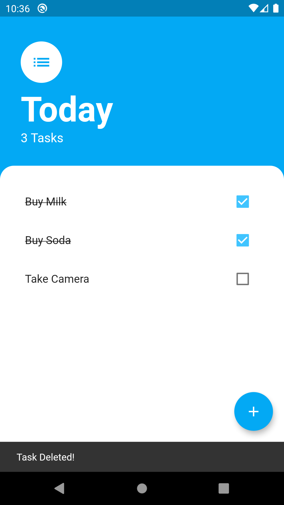

# Today

A cross platform app to make to-do lists.

### Tech

Today uses a number of tech to work properly:

* [FLUTTER] - Google’s UI toolkit for building beautiful, natively compiled applications.

And of course Today is open source with a public repository on GitHub.

## Download

| Version | Android | iOS |
| --- | --- | --- |
| 1.0.0 | [APK][1] | IPA |

### Screenshots
----

### Development

Want to contribute? Great! :heart:

Fork the repo make changes and make pull requests.

### Todos

 - Make a local database to store the data.
 - Add a online account system to sync data over the cloud.

License
----

Apache License 2.0

**Free Software, Hell Yeah!**

[//]: #DownloadLinks
[1]: https://github.com/i-am-ahad/today/releases/download/v1.0.0/today.apk
